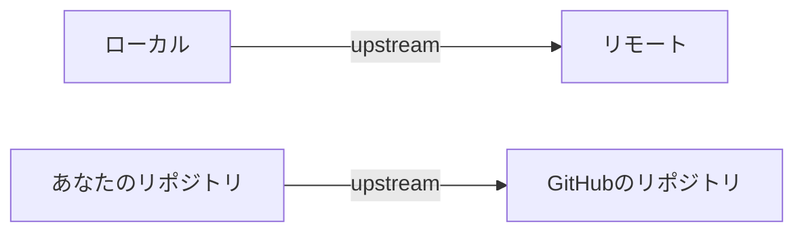
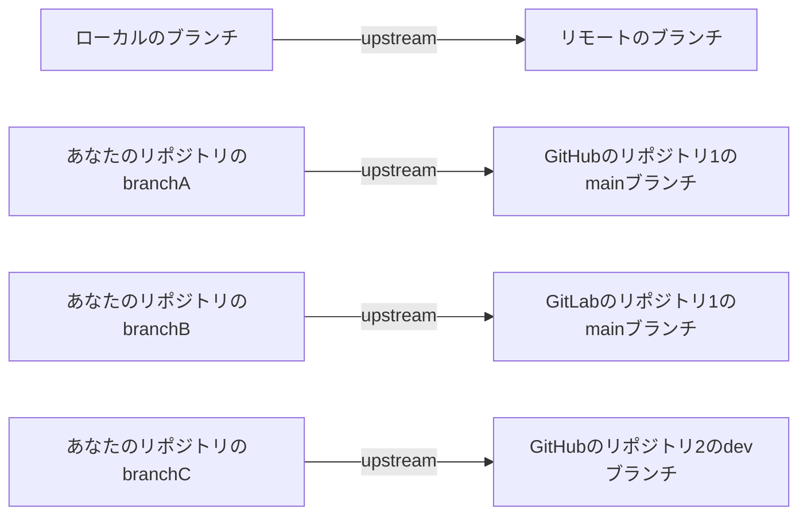
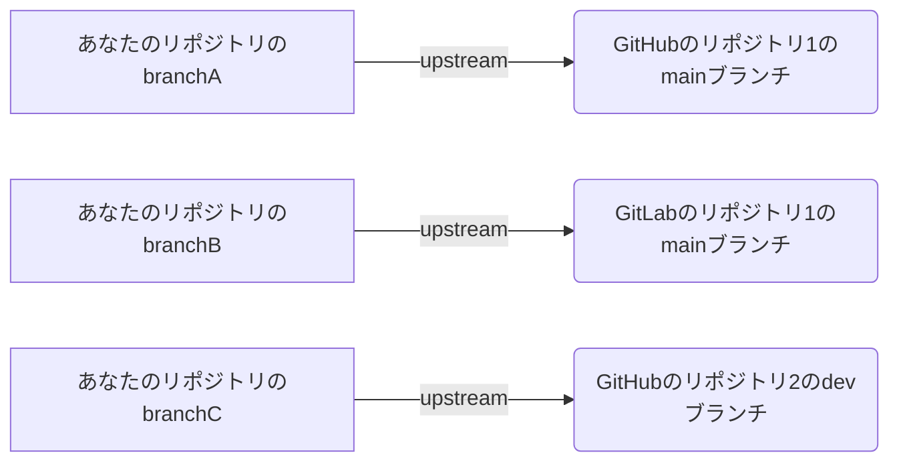
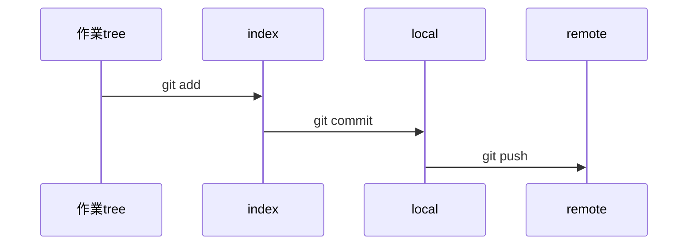

# 要約


# はじめに


## この文章を書いた動機


## この文章はだれ向けか


## この文書の読み方

# 本文

| 条件 | コマンド | gitの挙動 |
| ---- | -------- | ---- |
| ブランチを作成<br>かつ<br>そのブランチがない場合 | `git checkout -b ブランチ名` | |
| ブランチを作成<br>かつ<br>そのブランチがない場合 | `git branch ブランチ名` | ブランチ作成するもブランチを移動せず<br>`git switch/checkout` で移動するのを忘れないように。 |
| ブランチを作成<br>かつ<br>そのブランチがある場合| `git branch ブランチ名` | `git branch yabuki` <br> `fatal: A branch named 'yabuki' already exists.` |
| 指定ブランチへ移動 | `git checkout ブランチ名` | そのブランチへ移動する |
| 指定ブランチへ移動 | `git switch ブランチ名` | そのブランチへ移動する |
| 存在しない指定<br>ブランチへ移動 | `git checkout ブランチ名` | エラー発生し移動せず。<br>`git checkout hoge`<br> error: pathspec 'hoge' did not match any file(s) known to git  |
| 存在しない指定<br>ブランチへ移動 | `git switch ブランチ名` | エラー発生し移動せず。<br> fatal: invalid reference: ブランチ名 |
| ブランチを削除 | `git branch -d ブランチ名` | |
| ブランチを削除 | `git branch -D ブランチ名` | |
| rename/move | git branch -m ||
| ローカルのブランチ一覧 | `git branch` ||
| リモートのブランチ一覧 | `git ls-remote` ||
| ローカルから見た<br>ローカルとリモート<br>のブランチ一覧| `git branch -a` | 他者と作業しているなら、リモートのブランチは非同期で増えるので、必要なら `git ls-remote` を実行する必要があるかもしれない。 |

## upstream とは

--track, --no-track, --set-upstream とかで出てくる概念をまとめておく

下記のような図を見てイメージをつかんでほしい。

### 大まかなイメージ



### ブランチベースから見ると



### 作業ベースから見ると

ブランチは、機能だったり、人だったりが作業しているので下記のようなイメージ



## remote branch

- [Git - リモートブランチ](https://git-scm.com/book/ja/v2/Git-%E3%81%AE%E3%83%96%E3%83%A9%E3%83%B3%E3%83%81%E6%A9%9F%E8%83%BD-%E3%83%AA%E3%83%A2%E3%83%BC%E3%83%88%E3%83%96%E3%83%A9%E3%83%B3%E3%83%81)

### git remote show



```
git remote show orign
* remote origin
  Fetch URL: git@github.com:yabuki/friendly-potato.git
  Push  URL: git@github.com:yabuki/friendly-potato.git
  HEAD branch: gh-pages
  Remote branches:
    docs     tracked
    gh-pages tracked
  Local branches configured for 'git pull':
    docs     merges with remote docs
    gh-pages merges with remote gh-pages
  Local refs configured for 'git push':
    docs     pushes to docs     (fast-forwardable)
    gh-pages pushes to gh-pages (up to date)
```

## 利用シーン

### orphan

* gh-pages 用の docs ブランチを切る時。ドキュメントは別途コードの部分を含まなくていいですよね。

# 疑問点

* --track, --no-track とは?
*  git checkout は git branch へ丸投げしている。いまは
* --orphan と --detach の違い。
* detach とは何か?


# 参考にしたドキュメントたち


# 謝辞


# さいごに

|     件名       |   日付   |
|:----           |:----:|
|記事を書いた日  |2021-07-15|
|記事を変更した日|----------|

上記は、この記事の鮮度を判断する一助のために書き手が載せたものです。

詳細な変更履歴は、 [GitHub - yabuki/friendly-potato: zenn-contents](https://github.com/yabuki/friendly-potato) を参照してください。

記事に対するTypoの指摘などは、pull reqをしてもらえるとありがたいです。受け入れるかどうかは、差分とPull reqの文章で判断いたします。


<!-- 文章の目的は何か -->
  <!-- 読み手に何の情報を伝えるのか -->
  <!-- 読んだひとにどういう行動をしてもらいたいのか -->
<!-- だれに向けての文章か -->
<!-- この文章の肝はどこか -->
